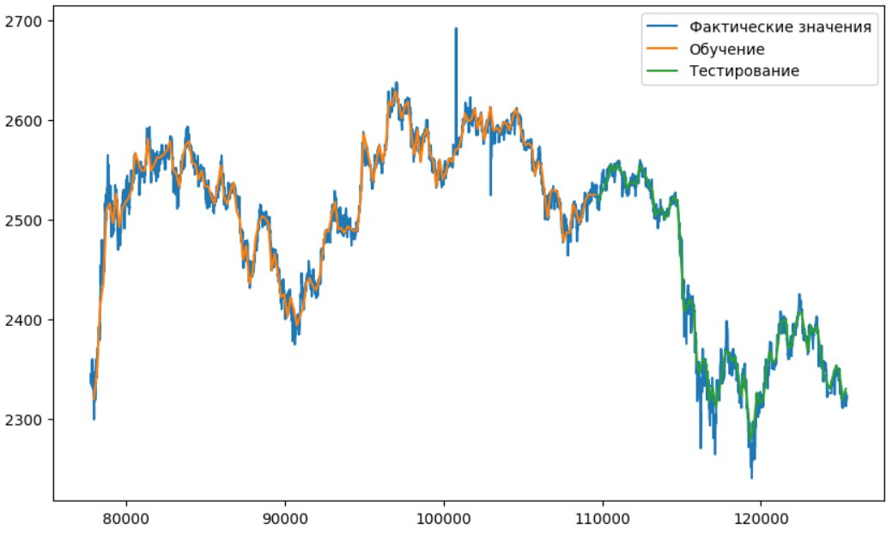

# Использование нейронных сетей для создания системы анализа и предсказания тенденций в развитии криптовалютных рынков

[](https://colab.research.google.com/drive/1iu_QYKM6qFgI9I9ew_pEGdZkqoPgrCv6?usp=sharing)

## Установка

Запустите скрипт:

```sh
pip install jupyter
pip install nbconvert
```

```sh
jupyter nbconvert --to notebook --execute
file_name.ipynb
```

## Алгоритм работы

Для построения модели прогнозирования цен на криптовалютном рынке я обучила `LSTM` модель на данных о изменении цены `BTC` к `USD`.

Цена и движение криптоваляюты зависят от нескольких факторов, таких как `bid`, `ask`, `low`, `high`. Моя модель была обучена на основе параметра `high`, то есть по максимальной цене, достигнутой активом за определенный временной период.

На выходе мы получаем примерное предсказание движение цены криптоваляюты.



## Использование

Для обучения модели я использовала `BTC`, поскольку в моем наборе данных содержится гораздо больше информации о его движениях по сравнению с другими валютами. Однако вы можете опробовать модель на данных о других валютах.

```python
df = data.loc[(data['rpt_key'] == 'btc_usd')]
```

**Замечание:** Для улучшения исходной `LSTM`-модели вы можете провести обучение на более обширном объеме данных или внести изменения в ее архитектуру.
